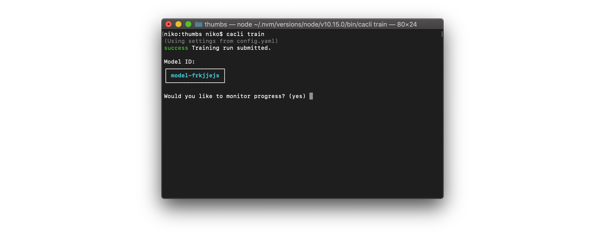

After we have collected and labeled our first round of images, we are ready to start training our model! 

We have a couple options for training:
- Export our annotations in a few popular formats and train the model ourselves.

- Use the Cloud Annotations CLI to easily deploy a training job to Watson Machine Learning.


# Cloud Annotations CLI
Using the Cloud Annotations CLI to train a model allows us to train a model quickly without touching any code.

## Installation
To train our model we need to install the Cloud Annotation CLI:
```bash
npm install -g cloud-annotations
```
> **Note: You’ll need to have Node 10.13.0 or later installed.** You can use [nvm](https://github.com/creationix/nvm#installation) (macOS/Linux) or [nvm-windows](https://github.com/coreybutler/nvm-windows#node-version-manager-nvm-for-windows) to easily switch Node versions between different projects.
